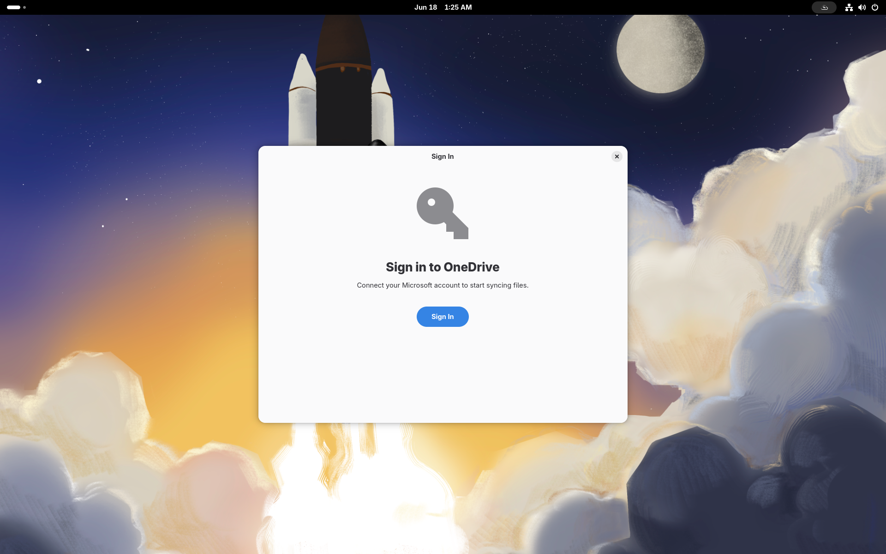
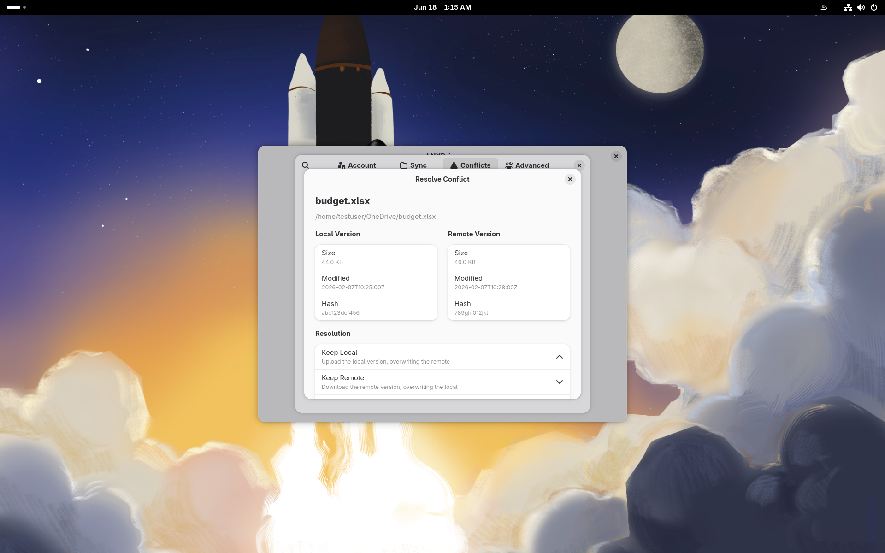
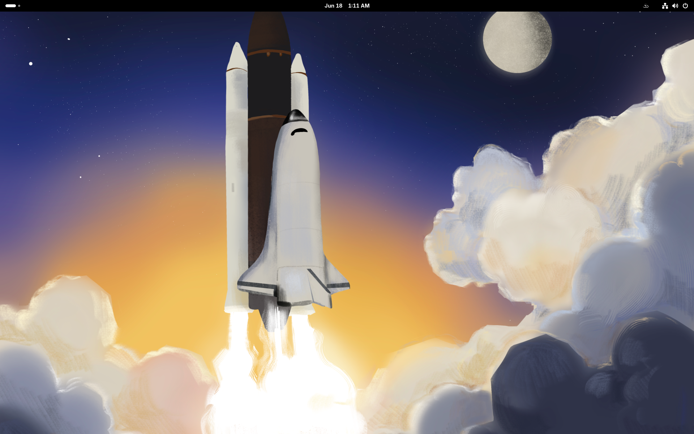
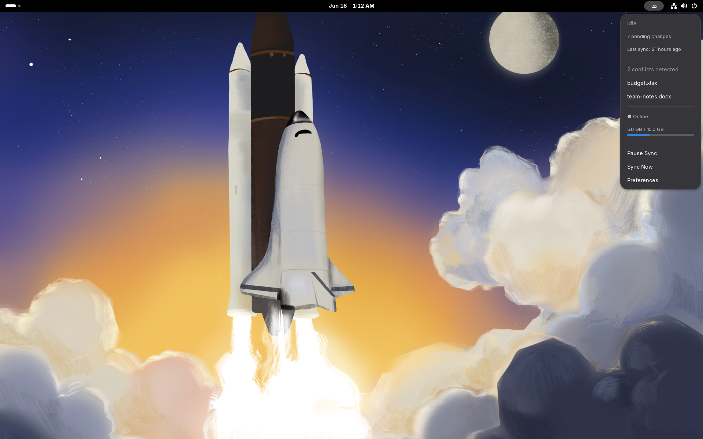
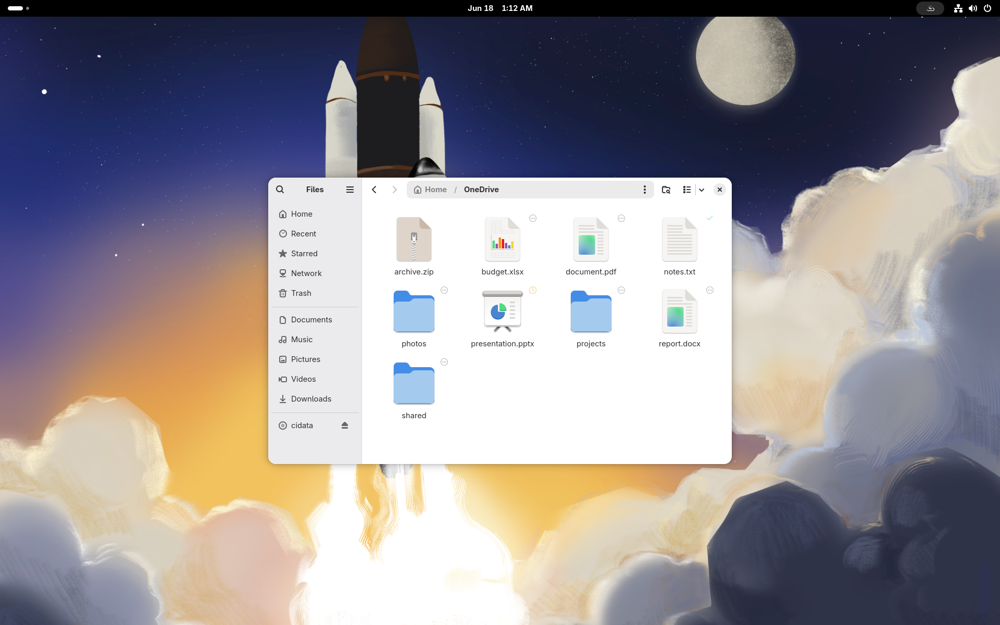

<p align="center">
  
</p>

<h1 align="center">LNXDrive</h1>

<p align="center">
  <strong>Cloud storage sync for Linux -- native, explainable, and built for every desktop.</strong>
</p>

<p align="center">
  <a href="LICENSE"></a>
  <a href="https://github.com/StrangeDaysTech/lnxdrive/releases"></a>
  <a href="https://github.com/StrangeDaysTech/lnxdrive/releases"></a>
  <a href="https://rust-lang.org"></a>
</p>

---

## What is LNXDrive?

LNXDrive is a cloud storage synchronization client for Linux designed from scratch with clean, hexagonal architecture. Unlike existing solutions that simply sync files in the background, LNXDrive is an **explainable, governable, and adaptable** sync system.

**Key differentiators:**

- **Explainable sync** -- You always know *why* something failed or didn't sync. No more cryptic "sync error" messages.
- **Files-on-Demand** -- A robust FUSE-based virtual filesystem with clear file states (online-only, locally available, always-keep). See your cloud files without downloading them.
- **Native desktop integration** -- Purpose-built UI for GNOME, KDE Plasma, COSMIC, and GTK3-based desktops (XFCE, MATE). Not a generic tray icon -- real shell extensions, file manager overlays, and system settings panels.
- **Multi-provider, multi-account** *(roadmap)* -- The provider port is designed for OneDrive, Google Drive, Dropbox, and more. The alpha ships **Microsoft OneDrive** support.
- **Declarative configuration** -- Versionable YAML config, not scattered dotfiles and CLI flags.
- **Full observability** -- Structured JSON logs, Prometheus metrics, and a complete audit trail.

## How it works

LNXDrive runs as a user-level **systemd service** (`lnxdrive-daemon`) that manages all sync operations. It communicates with desktop integrations through **D-Bus** (`com.strangedaystech.LNXDrive`), and exposes a **FUSE filesystem** for files-on-demand.

```
Cloud Providers          LNXDrive Engine              Desktop
  (OneDrive,        ┌─────────────────────┐      ┌──────────────┐
   GDrive,          │  lnxdrive-daemon    │      │ GNOME Shell  │
   Dropbox...)  <──>│  ├─ sync engine     │<────>│ KDE Plasma   │
                    │  ├─ FUSE mount      │ D-Bus│ COSMIC       │
                    │  ├─ conflict mgr    │      │ GTK3 (XFCE)  │
                    │  └─ audit + metrics │      │ CLI           │
                    └─────────────────────┘      └──────────────┘
```

---

## Screenshots

| | | |
|:---:|:---:|:---:|
|  |  |  |
| *Preferences: account & quota* | *Onboarding wizard* | *Conflict resolution* |
|  |  |  |
| *GNOME Shell indicator* | *Status menu* | *Nautilus sync overlays* |

---

## Getting Started

> LNXDrive is in **alpha** (`v0.1.0-alpha.1`), aimed at Linux power users and GNOME enthusiasts willing to [report bugs](https://github.com/StrangeDaysTech/lnxdrive/issues). The alpha is **GNOME-only** and supports **Microsoft OneDrive**.

### Requirements

- Linux with FUSE 3 support and Flatpak ≥ 1.12
- GNOME (Wayland recommended) — the bundle pulls the `org.gnome.Platform//49` runtime automatically

### Installation (Flatpak)

```bash
flatpak install --user \
  https://github.com/StrangeDaysTech/lnxdrive/releases/download/v0.1.0-alpha.1/lnxdrive.flatpak
```

Verify the download against the `SHA256SUMS` file published with each
[release](https://github.com/StrangeDaysTech/lnxdrive/releases).

Other formats (RPM, DEB, AUR, AppImage, Flathub) are planned for `v0.2.0-beta`.

### First steps

1. **Launch LNXDrive** from your application menu (or `flatpak run com.strangedaystech.LNXDrive`) — the onboarding wizard opens on first run
2. **Sign in to OneDrive** — via GNOME Online Accounts or the browser OAuth flow; tokens are stored in the system keyring, never on disk
3. **Choose what to sync** — pick OneDrive folders (nested selective sync supported)
4. **Start the daemon**: `flatpak run --command=lnxdrived com.strangedaystech.LNXDrive`

> **Alpha limitations**: the Flatpak bundle does not include the Nautilus
> overlay extension, the GNOME Shell indicator, or the GOA provider — these
> load into host processes and can't ship inside the sandbox. They are
> available when [building from source](#building-from-source). See
> [CHANGELOG.md](CHANGELOG.md) for the full list.

### CLI quick start

```bash
alias lnxdrive='flatpak run --command=lnxdrive com.strangedaystech.LNXDrive'

# Check daemon and sync status
lnxdrive status

# Authenticate with OneDrive
lnxdrive auth login

# Mount the files-on-demand filesystem
lnxdrive mount

# Why is this file in its current state?
lnxdrive explain ~/OneDrive/report.xlsx
```

> **Not yet functional in this alpha:** `lnxdrive pin` (keep a folder always
> available offline) and `lnxdrive dehydrate` (free local space on demand) are
> scaffolded but not yet wired to the files-on-demand engine — they report what
> they *would* do without changing local state, and land fully wired in
> `v0.2.0-beta`.

---

## How does it compare?

Both alternatives are mature, actively maintained projects — credit where due.
LNXDrive is the **alpha** newcomer betting on deep desktop integration and
explainability:

| | **LNXDrive** (alpha) | [jstaf/onedriver](https://github.com/jstaf/onedriver) | [abraunegg/onedrive](https://github.com/abraunegg/onedrive) |
|---|---|---|---|
| Approach | Background sync **+** FUSE files-on-demand | Pure on-demand FUSE filesystem (no offline sync) | Full bidirectional sync client |
| Maturity | **Alpha** | Stable | Stable, very featureful |
| Language | Rust | Go | D |
| Files-on-demand | ✅ FUSE, with pin/unpin/hydrate states | ✅ FUSE (cache-based) | ❌ (downloads everything selected) |
| Selective sync | ✅ nested folder picker (GUI) | — (on-demand by nature) | ✅ (config file: `sync_list`) |
| Native settings GUI | ✅ GTK4/libadwaita panel | Minimal launcher GUI | ❌ CLI (third-party GUIs exist) |
| File manager integration | ✅ Nautilus sync-state overlays* | ❌ | ❌ |
| Desktop SSO | ✅ GNOME Online Accounts | ❌ (own OAuth flow) | ❌ (own OAuth flow) |
| Explainability | ✅ `lnxdrive explain <file>`, audit log | ❌ | Verbose logs |
| Token storage | System keyring (Secret Service) | System keyring | Config dir file |
| OneDrive Business / SharePoint | Not yet (alpha) | ✅ | ✅ |
| Packaging | Flatpak bundle | distro packages (COPR, etc.) | distro packages, Docker |

<sub>*From source on the host; not included in the Flatpak sandbox (alpha).</sub>

If you need OneDrive **Business/SharePoint today**, use one of the
alternatives. If you want native GNOME integration with files-on-demand and
explainable sync — that's the gap LNXDrive exists to fill.

---

## For Developers

### Project Structure

This is a **monorepo** containing all LNXDrive components:

| Directory | Description | Stack |
|-----------|-------------|-------|
| [`lnxdrive-engine/`](lnxdrive-engine/) | Core daemon and library crates | Rust 1.75+, tokio, zbus, sqlx |
| [`lnxdrive-gnome/`](lnxdrive-gnome/) | GNOME Shell, Nautilus, and GOA integration | Meson + Rust (gtk4-rs), GJS, C |
| [`experimental/lnxdrive-gtk3/`](experimental/lnxdrive-gtk3/) | XFCE/MATE desktop UI — archived for v0.1.0-alpha (reactivates in v1.0.0) | Rust, GTK3 |
| [`experimental/lnxdrive-plasma/`](experimental/lnxdrive-plasma/) | KDE Plasma integration — archived for v0.1.0-alpha (reactivates in v1.0.0) | C++, CMake, Qt/KDE |
| [`experimental/lnxdrive-cosmic/`](experimental/lnxdrive-cosmic/) | COSMIC desktop UI — archived for v0.1.0-alpha (reactivates in v1.0.0) | Rust, libcosmic |
| [`lnxdrive-packaging/`](lnxdrive-packaging/) | Distribution packages | Flatpak, AppImage, Debian, AUR |
| [`lnxdrive-guide/`](lnxdrive-guide/) | Design and development guide | Markdown |
| [`lnxdrive-testing/`](lnxdrive-testing/) | Container/VM test infrastructure | Podman, QEMU/libvirt |

### Architecture

The engine follows a **hexagonal (ports & adapters) architecture**:

- **Domain core** (`lnxdrive-core`) defines sync logic, conflict resolution rules, and provider-agnostic interfaces
- **Adapters** implement cloud provider APIs (Microsoft Graph, etc.), storage backends (SQLite), and IPC (D-Bus)
- **Desktop UIs** are fully interchangeable -- each desktop environment has its own native adapter

For a comprehensive deep-dive, see the [Design and Development Guide](lnxdrive-guide/).

### Building from source

```bash
# Clone the repository
git clone https://github.com/StrangeDaysTech/lnxdrive.git
cd lnxdrive

# Build the engine
cd lnxdrive-engine
cargo build
cargo test

# Build GNOME integration (requires meson, gtk4-devel, etc.)
cd ../lnxdrive-gnome
meson setup builddir
meson compile -C builddir
```

### Development workflow

1. **Read the [Contributing Guide](CONTRIBUTING.md)** -- it covers branching, commit conventions, and the review process
2. **Read the [Code of Conduct](CODE_OF_CONDUCT.md)** -- participation requires respectful, inclusive behavior
3. **Never commit directly to `main`** -- use feature branches and pull requests
4. **Follow conventional commits** -- `feat:`, `fix:`, `docs:`, `refactor:`, `chore:`
5. **Sign the CLA** -- required on your first pull request

### Documentation trail

This project uses [StrayMark](https://github.com/StrangeDaysTech/straymark) to maintain a complete documentation trail of architectural decisions, AI-assisted changes, and technical debt. See `.straymark/` for the full audit history.

---

## Roadmap

| Milestone | Scope | Status |
|-----------|-------|--------|
| `v0.1.0-alpha.1` | OneDrive engine (sync, delta, FUSE files-on-demand), CLI, GNOME stack (GTK4 panel, Shell indicator, Nautilus overlays, GOA SSO), Flatpak bundle | **Current** |
| `v0.2.0-beta` | System settings group (auto-start, cache, dehydration), RPM/DEB/AUR/AppImage, Flathub submission, D-Bus Unix-socket fallback, i18n structure, telemetry opt-in | Planned |
| `v1.0.0` | KDE Plasma, COSMIC and GTK3 (XFCE/MATE) front-ends, multi-provider (Google Drive, Dropbox), 5+ languages | Planned |

Work is tracked publicly in [GitHub Issues](https://github.com/StrangeDaysTech/lnxdrive/issues)
and milestones; for detailed deliverables see [the roadmap document](lnxdrive-guide/09-Referencia/02-hoja-de-ruta.md).

---

## Contributing

We welcome contributions of all kinds -- code, documentation, testing, translations, and ideas.

Please read our **[Contributing Guide](CONTRIBUTING.md)** and **[Code of Conduct](CODE_OF_CONDUCT.md)** before getting started. All contributors must sign a Contributor License Agreement (CLA) on their first pull request.

---

## License

LNXDrive is free software licensed under the **[GNU General Public License v3.0 or later](LICENSE)**.

The [Design and Development Guide](lnxdrive-guide/) is licensed separately under the [MIT License](lnxdrive-guide/LICENSE).

---

<p align="center">
  <a href="https://strangedays.tech"><strong>Strange Days Tech, S.A.S.</strong></a><br>
  Because your files belong everywhere.
</p>
